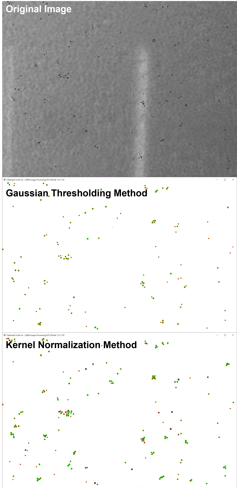

# Microparticle detection in whole blood

## Purpose:
BloodpartML (Blood Particle Machine Learning) is a functional testbed for image analysis of whole-blood microscopy image sets. Its foundation is software I wrote for the characterization of drug-delivery particles in whole blood. 

## Background:
Due to the high concentration of red blood cells (RBCs) in whole blood, detection and dimensional characterization of ~1-5μm exogenous particles using impedance (e.g. Coulter counter) or purely optical methods (e.g. flow-cytometry) is infeasible.  Thus, a means of discriminating exogenous particles from a confluence of RBCs is necessary to determine the quantity, size, and shape of such microparticles. 

Images serve as datasets for the eccentric application of machine learning classification methodologies such as Gaussian Mixture Models and K-means clustering.  

## Future work:
Decision-tree (random-forest) fitting of detected particles for further validation and filtering. 

## How to use:
### The program reads your data folder and asks you to select a specific image dataset:

> ['trial 1', 'trial 2', 'trial 3']  
> Choice 1: trial 1  
> Choice 2: trial 2  
> Choice 3: trial 3  
>  
> **Pick choice 1-3:  <enter an input> **

### Then a sub-experiment (in this case, timepoint in minutes)

> Choice 1: 1  
> Choice 2: 10  
> Choice 3: 2  
> Choice 4: 3  
> Choice 5: 4  
> Choice 6: 5  
>  
> **Pick subdirectory 1-6:  <enter an input> **

### Next, pick from the list of image processing methods:

> ..\SMB Image Processing\50-50\trial 1\1  
> Pick an image processing method:
> 1: for Normalized Convolution.  
> 2: for Gaussian Thresholding.   
> 3: for K-Means clustering.   
> 4: for Gaussian Mixture Model.
>
> **Pick choice 1-4: <enter an input> **

## De-noising and image normalization
Brightfield microscopy, particularly of blood samples, can yield suboptimal images with a wide variety of image anomalies and noise types (gradients, blotchiness, uneven contrast).  

## Edge-detection kernel vs. k-means clustering of pixel intensities: 

## How BloodpartML works:

Bloodpart extracts features by: 
1. (Channelizing) Grayscale conversion.
2. (ML Classification)  Classification of pixels by shade-of-gray.
3. (Convolve) Applying a normalization kernel to each image,
4. (Thresholding) If conventional image processing, apply thresholding. 
5. Convolvement and circle-detection methods (i.e. Hough Transform).

2. To determine the dose of particles in blood, Bloodpart relates particle counts to a calculated fluid volume represented by each image (as derived from image size, and user parameters under <code> main.py ##User Parameters##) </code>.
</ul>

## Example outputs: 

> Total number of particles counted was: 57845088.  
> Number of images counted was: 19.  
> Microscope objective used: 20x.  
> Dilution correction was: 3.9.  
> Volume of blood per microscope slide was: 14.1375.  
> Average particle size was: 3.25 microns.  
> **Concentration of blood particles is: 839856087114.3375 per mL.  **

## Visualized particle detection:  
 

## Image dataset requirements:
- An **image dataset** folder (i.e. '\\images') should contain: 
    - subfolders for **each experiment** (i.e. '\\trial 1') which should contain: 
        - subfolders for **each timepoint** within the experiment (i.e. '\\1min') which should contain: 
            - **images** taken from each timepoint.
