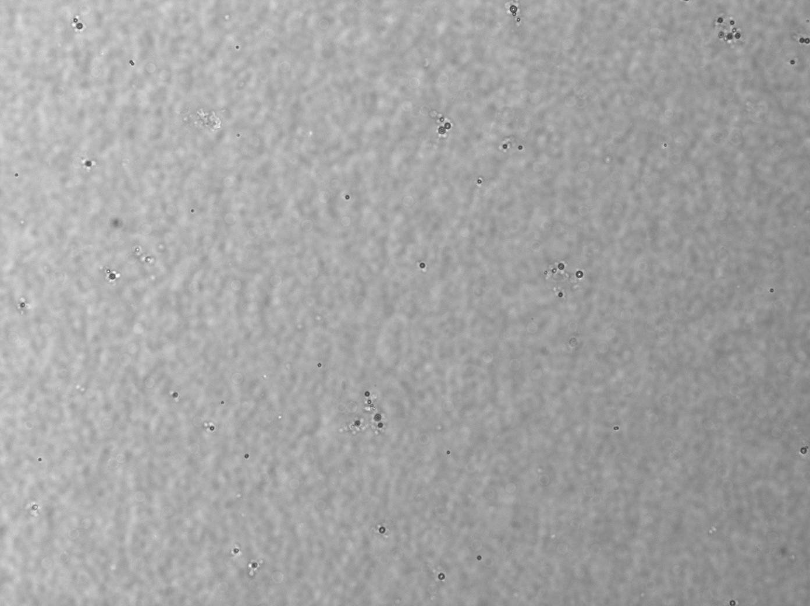
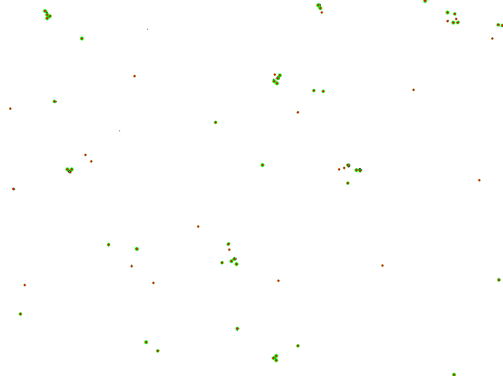

# Microparticle detection in whole blood

Last image processed (updated every commit)              |  Particles detected
:-------------------------:|:-------------------------:
  |  

## Purpose:
BloodpartML (Blood Particle Machine Learning) started out as a functional testbed for image enhancement and image analysis techniques for the characterization of microbubbles in whole blood.  Image processing in ImageJ struggled to accommodate variations between images such as image gradients, blood clots, and anomalies related to microscopy and samples. 

With over 300 images per experiment and a backlog of trials, Blood particle analyzer (Bloodpart1) was born with the purpose of saving my colleagues' and my sanity.    
BloodpartML is an extension of that effort.   

## Background:
Due to the high concentration of red blood cells (RBCs) in whole blood, detection and dimensional characterization of ~1-5μm exogenous particles using impedance (e.g. Coulter counter) or purely optical methods (e.g. flow-cytometry) is infeasible.  Thus, a means of discriminating exogenous particles from a confluence of RBCs is necessary to determine the quantity, size, and shape of such microparticles. 

Here, we apply classical image processing as well as machine learning classification methodologies (i.e. Gaussian Mixture Models and K-means clustering) for image enhancement and object detection.   

## How BloodpartML works:

Broadly, Bloodpart extracts features by: 
1. (Channelizing) Grayscale conversion.
2. (ML Classification)  Classification of pixels by shade-of-gray.
3. (Convolve) Applying a normalization kernel to each image,
4. (Thresholding) If conventional image processing, apply thresholding. 
5. (Object detection) Simpler object detection methods (i.e. Hough Circle Transforms) for rapid assessment of image normalization, as well as more complex methods for particle characterization.

2. To determine the dose of particles in blood, Bloodpart relates particle counts to a calculated fluid volume represented by each image (as derived from image size, and user parameters under <code> main.py ##User Parameters##) </code>.
</ul>

## Rationale for improving de-noising and image normalization
Brightfield microscopy, particularly of blood samples, can yield suboptimal images with a wide variety of image anomalies and noise types (gradients, blotchiness, uneven contrast).  

<b><h3>Edge-detection kernel vs. immediate (k-means) clustering of pixel intensities:</h3></b>

## Challenges:
Differing red blood cell concentrations from image to image (and within images) generated non-trivial pixel intensity gradients. I found Contrast Limited Adaptive Histogram Equalization (<b>CLAHE</b>) useful in mitigating these macro-gradients. See reference below for additional information on CLAHE.    
Manually determining the optimal CLAHE parameters (clip-limit and tile-grid-size) for every image would be near impossible due to the large number of images involved (see References). My current hypothesis is that <b>clip-limit</b> is desired the optimized parameter, and I believe I can optimize it by comparing average pixel intensities across area-divided sectors: If the upper left corner is bright, and the lower right corner is dark, our algorithm would pick the clip-limit that caused the minimum delta in mean pixel intensities between the two.  
* Reference: <a href = "https://jivp-eurasipjournals.springeropen.com/articles/10.1186/s13640-019-0445-4">Machine learning hyperparameter selection for Contrast Limited Adaptive Histogram Equalization </a>

## Future work:
I've found that object/anomaly detection in whole-blood imagery is a fascinating test for image processing and object detection techniques. Additional features are planned here:
* CLAHE iterations on clip-limit parameter to minimize macro-gradients. 
* Adaptation to microvideography for object tracking (and characterization) in frame. 
* Experimentation with PyTorch, Residual Networks, RetinaNet for object detection.
* Build front-end before distribution.

## How to use:
### The program reads your data folder and asks you to select a specific image dataset:

> ['trial 1', 'trial 2', 'trial 3']  
> Choice 1: trial 1  
> Choice 2: trial 2  
> Choice 3: trial 3  
>  
> **Pick choice 1-3:  <enter an input> **

### Then a sub-experiment (in this case, timepoint in minutes)

> Choice 1: 1  
> Choice 2: 10  
> Choice 3: 2  
> Choice 4: 3  
> Choice 5: 4  
> Choice 6: 5  
>  
> **Pick subdirectory 1-6:  <enter an input> **

### Next, pick from the list of image processing methods:

> ..\SMB Image Processing\50-50\trial 1\1  
> Pick an image processing method:
> 1: for Normalized Convolution.  
> 2: for Gaussian Thresholding.   
> 3: for K-Means clustering.   
> 4: for Gaussian Mixture Model.
>
> **Pick choice 1-4: <enter an input> **

## Example outputs: 

> Total number of particles counted was: 57845088.  
> Number of images counted was: 19.  
> Microscope objective used: 20x.  
> Dilution correction was: 3.9.  
> Volume of blood per microscope slide was: 14.1375.  
> Average particle size was: 3.25 microns.  
> **Concentration of blood particles is: 839856087114.3375 per mL.  **

## Image dataset requirements:
- An **image dataset** folder (i.e. '\\images') should contain: 
    - subfolders for **each experiment** (i.e. '\\trial 1') which should contain: 
        - subfolders for **each timepoint** within the experiment (i.e. '\\1min') which should contain: 
            - **images** taken from each timepoint.
